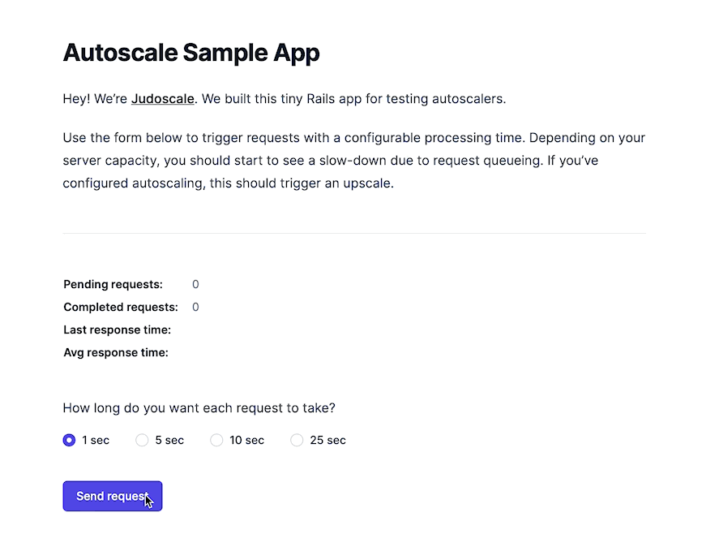

# Autoscale Example App

A tiny Rails app (from the folks at [Judoscale](https://judoscale.com)) for testing autoscalers.

## What do you mean "testing autoscalers"?

The only way to see an autoscaler in action is to force your app to hit its current server capacity. This app makes it easy by specifying how long you want requests and jobs to take.

## How do I use it?

First, you deploy your own instance. Use one of the buttons below to deploy.

Once deployed, just open the app in a browser and follow the instructions.

## How do I make changes?

If you only want to make _configuration changes_ to your deployment, you can use the deploy buttons here without creating your own repo. Just tweak the environment variables in Heroku or Render.

If you want to make _code changes_, you'll need to [create a new repo from the template](https://github.com/judoscale/autoscale-example-app/generate) first.
